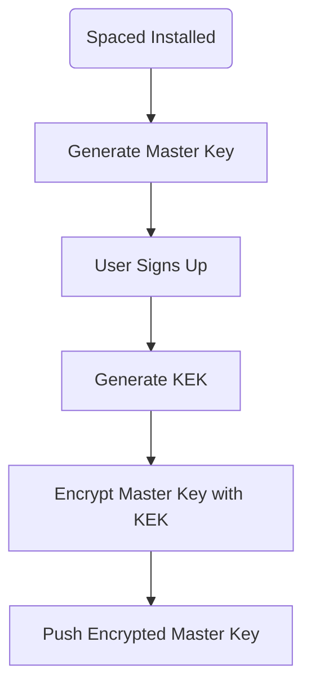

# Encryption

Spaced leverages E2EE (end-to-end encryption) to securely store your media on the cloud. The following architecture document defines how we encrypt your data. 

## Flows

There are various flows necessary for handling end-to-end encryption in Spaced.

### User Registration

When Spaced is installed on a device, it automatically generates a secure `Master Key`. When a user signs up for Spaced, we generate a `Key Encryption Key` or `KEK`. We then encrypt your `Master Key` with the `KEK` and store it securely on our database.

