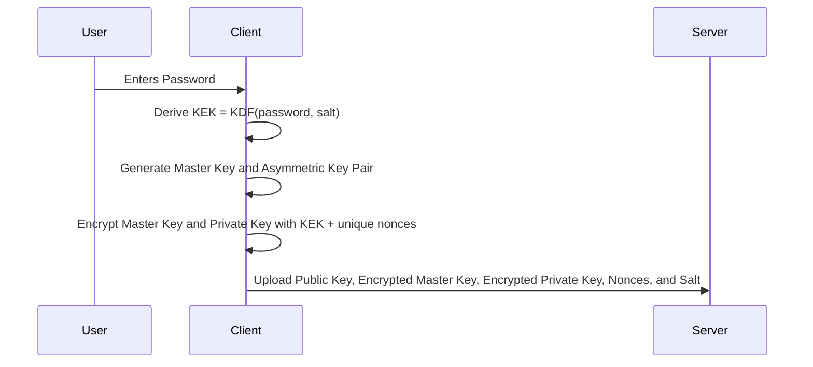
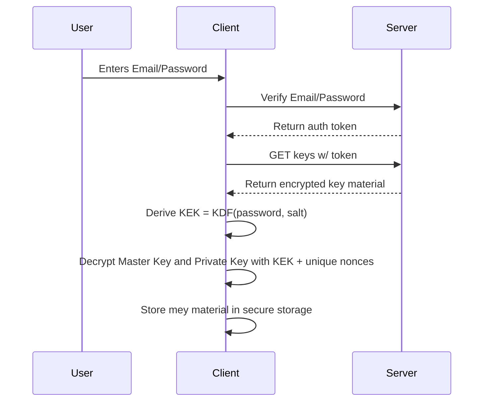

# Encryption

Spaced leverages E2EE (end-to-end encryption) to securely store your media on the cloud. The following architecture document defines how we encrypt your data so that only you and those you trust have access.

## Flows

There are various flows necessary for handling end-to-end encryption in Spaced.

### User Registration

When Spaced is installed on a device, it automatically generates a secure `Master Key` and `Key Pair` made up of a `Public Key` and `Private Key`. When a user signs up for Spaced, we generate a `Key Encryption Key` or `KEK`. We then encrypt your `Master Key` and `Private Key`  with the `KEK` and store it securely on our database.

### User Login

On subsequent logins, if you have successfully verified your email, we send back your encrypted `Master Key` and `Key Pair` that was saved on registration. You are prompted to enter your password, which will decrypt your `Master Key` and `Private Key` and make it available locally on your client.

### Spaces

Spaces are a collection of photos or videos that are shared either publicly or privately.

Each space has a `Space Key`. The `Space Key` never leaves your device without being encrypted.

When you sign up for Spaced, a `Public Key` and `Private Key` are generated for you. The `Public Key` is public, and sent to our database in plain text. 

When a user is added to a Space, the `Space Key` is encrypted using the recipients `Public Key` and made available to their device. They then download it and decrypt it and can now read the media stored in that space.

#### Private Spaces

Private spaces can only be accessed using an invitation. When an invitation is sent to a user, the `Encrypted Space Key` is stored pending invitation acceptance.

If the user rejects the invitation, the `Encrypted Space Key` is deleted and a new invitation must be sent.

##### Invitation Links

Users can also be invited to a private space by using a link. When a user generates an invite link to a private space, a `Public Key` and `token` are generated. The `Public Key` is used to encrypted the `Space Key` and the cryptographic `token` is passed along with the invitation link.

Invitation links can be configured with a specific amount of uses, or an expiration time.

**Link Creation**

**Invitation Accepted**

#### Public Spaces

Public spaces are functionally the same as a private space, except that any user can join and leave them at-will. The data of public spaces is encrypted like any other data on Spaced, but users can obtain the `Space Key` simply by joining.

Joining a public space works very similarly to being invited to a private space, except that joining a public space uses an **indefinite invitation link**. Unlike the short-lived `token` for a private space, a public space `token` never expires, as long as the Space continues to be public.

### User Profiles

Users can upload photos and video to their profile. A profile is functionally like a Space. A user can either have their profile be private or public. 

When a user signs up for Spaced, a `Space Key` is generated for their profile. This `Space Key` is encrypted using your `Master Key` and stored encrypted in our database. This allows access to your profile in cases where you are on a new device, or your local data was deleted.

#### Public Profiles

When a user sets their profile to "public", a `Public Key` is generated that encrypts the `Space Key` for your profile. Both the `Public Key` and `Encrypted Space Key` are stored in our database. 

When users load your account, the `Public Key` and `Encrypted Space Key` are downloaded and used to decrypt the media in your profile.

**Profile set to public**

#### Private Profiles

Users can request to follow private profiles. A user requests to follow an account, and when that request is accepted the requester's `Public Key` is used to encrypt the `Space Key` representing that user's profile.

## Key Rotation

In all cases, we will rotate `Space Keys` on occasion to ensure that nobody has lingering access to data they are no longer privy to. More details on the "what" and "when" of key rotation will be coming at a later date.
